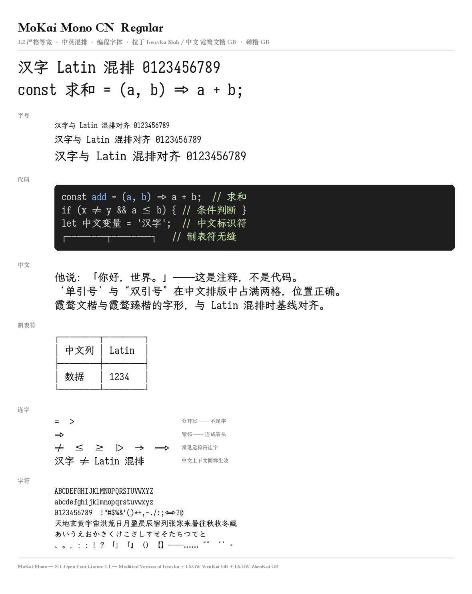
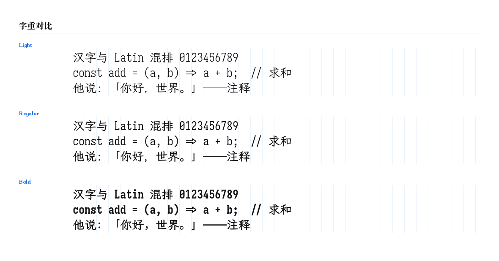

# MoKai Mono / 墨楷等宽

**一款 1:2 严格等宽的中英混排编程字体。**

汉字占 **2 格**、拉丁占 **1 格**，终端里中英混排不会错位。

- **拉丁** 来自 [Iosevka Slab](https://github.com/be5invis/Iosevka)，带编程连字
- **中文** 来自 [霞鹜文楷 GB](https://github.com/lxgw/LxgwWenKaiGB) 与
  [霞鹜臻楷 GB](https://github.com/lxgw/LxgwZhenKai)，遵循**大陆 G 源字形**规范
- 含 **Nerd Fonts** 图标、**竖排度量**、**中文全角引号**



展示图使用 HarfBuzz + FreeType 真实排版渲染，代码块里的 `=>`、`!=`、`<=` 等会实际应用 OpenType 连字；不是使用不支持连字的基础绘制引擎。

---

## 字重

中文侧做了**整体上移一格**的偏移 —— 文楷笔画偏细，若按名义字重一一对应，
中文会明显比拉丁轻：

| 字重 | 中文 | 拉丁 |
|---|---|---|
| Light | 霞鹜文楷 GB Regular | Iosevka Slab Light |
| Regular | 霞鹜文楷 GB Medium | Iosevka Slab Regular |
| **Bold** | **霞鹜臻楷 GB Regular** | Iosevka Slab Bold |



---

## 该下载哪个文件

文件名里的修饰符按 **间距 → NF → CN → unhinted** 排列。
**没有 `unhinted` 就是带 hinting。**

### 第一步：选间距

| 变体 | 破折号 / 箭头 | 连字 | 适合 |
|---|---|---|---|
| **`MoKaiMono`** | 全宽 | 有 | 通用、写作排版 |
| **`MoKaiMonoTerm`** | 半宽 | 有 | **终端推荐** |
| **`MoKaiMonoNL`** | 全宽 | 无 | 通用但不要连字 |
| **`MoKaiMonoTermNL`** | 半宽 | 无 | 终端且不要连字 |

### 第二步：选 NF

| 标记 | 含义 |
|---|---|
| 无 `NF` | 纯字体 |
| 有 `NF` | 含 Nerd Fonts 图标（Powerline / Font Awesome / Material Design Icons / Octicons / Devicons 等） |

### 第三步：选 hinting

| 标记 | 含义 |
|---|---|
| 无 `unhinted` | 带 hinting，Windows 下小字号更锐利 |
| 有 `unhinted` | 无 hinting，文件略小 |

### 完整清单

```
MoKaiMono-CN-{Light,Regular,Bold}.ttf              标准 Slab
MoKaiMonoTerm-NF-CN-{...}.ttf                      终端优化 + 图标
MoKaiMonoNL-CN-unhinted-{...}.ttf                  标准间距、无连字、无 hinting
MoKaiMonoTermNL-NF-CN-{...}.ttf                    终端优化、无连字 + 图标
```

`CN` 表示**大陆 G 源字形**。矩阵总计 **48 个字体**：24 个普通版 + 24 个 NF 版；
每个 TTF 都有对应的 WOFF2 版本。

打包文件 `MoKaiMonoTerm-NF-CN.zip` 之类内含全部字重，
WOFF2 包以 `-Woff2.zip` 结尾；每个 zip 都配一份 `.sha256`。

> **懒人包**：终端用户直接用 `MoKaiMonoTerm-NF-CN.zip`。

---

## 字符集

收录与臻楷重叠的 **22,365 个码位**，三个字重的字符集**完全一致** ——
任何字在任何字重下都不会变成豆腐块。

| 区块 | 数量 |
|---|---|
| CJK 统一表意文字（基本区） | 20,992 |
| CJK 扩展 A | 161 |
| CJK 扩展 B 及以后 | 292 |
| 假名 | 185 |
| 全角形式、CJK 标点、注音等 | 735 |

---

## 已实现的中文排版处理

- **中文全角引号**：`‘’“”` 宽度统一到 1000，左引号右移贴住后一个字
  （参照 [Sarasa Gothic](https://github.com/be5invis/Sarasa-Gothic) 的
  `quoteLeft` / `quoteRight` 处理）
- **中文标点保持双宽**：`、。，：；！？「」（）` 等
- **制表符无缝拼接**：`┌─┬─┐` 等墨迹精确触及格子边界，终端里画表格不断线
- **竖排度量**：含 `vhea` / `vmtx`，竖排前进量恰为 1em
- **等宽不变量**：所有字形宽度严格 ∈ {0, 500, 1000}

---

## 已知限制

- **不含斜体**。中文没有斜体设计，请交由编辑器做机械倾斜。
- **不含可变字体**。中文是静态轮廓，无法与 Iosevka 的可变版本组合。
- 字符集不含 CJK 扩展 A/B 的大部分（受限于中文源与 65,535 字形上限）。
- 为控制字形数，未包含 Iosevka 的 `cv01-cv99` 字符变体特性；
  `ss01-ss20`、连字、分数、旧式数字等特性均保留。

---

## 从源码构建

需要 Python 3.12+，以及 [FontForge](https://fontforge.org/)（用于 Nerd Fonts 补丁）。

```bash
python3 -m venv .venv && . .venv/bin/activate
pip install -r requirements.txt

python src/build.py fetch       # 下载上游产物
python src/build.py licenses    # 抓取上游许可证
python src/build.py merge       # 裁剪骨架 + 注入合并
python src/build.py patch       # 打 Nerd Fonts 补丁
python src/build.py package     # 生成 TTF / WOFF2 + zip + 校验和
python src/build.py specimen    # 生成展示图（真实 HarfBuzz 排版）
```

限定范围：`--spacing slab|slab-nl|term|term-nl`、`--only Light|Regular|Bold`。

产物在 `out/`。设计与实现细节见 [docs/DESIGN.md](docs/DESIGN.md)。

---

## 许可

本项目采用 [SIL Open Font License 1.1](https://openfontlicense.org)。

这是**修改版本（Modified Version）**，由以下字体合并而成：

- [霞鹜文楷 / LXGW WenKai](https://github.com/lxgw/LxgwWenKai)（Copyright © LXGW）
- [霞鹜臻楷 / LXGW ZhenKai](https://github.com/lxgw/LxgwZhenKai)（Copyright © LXGW）
- [Iosevka](https://github.com/be5invis/Iosevka)（Copyright © 2015-2026 Renzhi Li / Belleve Invis）

三者均以 SIL OFL 1.1 授权。上游声明的**保留字体名**为
`霞鹜 / 霞鶩 / 落霞孤鹜 / 落霞孤鶩 / LXGW`，本衍生字体的名称中**不含**这些字样。

根据 OFL 1.1 第 1 条，**禁止单独出售字体文件**。完整许可证见 `LICENSES/`。

本项目与上述上游作者无隶属关系，亦未获其背书。
